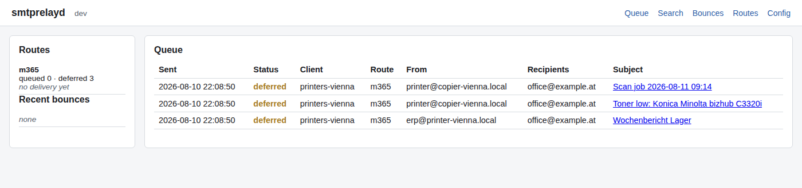

# smtprelayd — Open Source SMTP Relay for Windows & Linux

[](https://github.com/tokajer/smtprelayd/releases)

Accepts mail from printers, ERP systems and monitoring on the local network and
forwards it to a smarthost — primarily Microsoft 365 using OAuth2 / XOAUTH2.
Runs as a Windows service or a systemd unit from a single static binary, with
no runtime dependencies and no cgo.



## Features

- SMTP on port 25, submission on 587, implicit TLS (SMTPS) on 465
- Durable on-disk queue with crash recovery and exponential retry
- Per-client policy matched by CIDR: sender rewriting, rate limits, size limits
- Microsoft 365 authentication via OAuth2 client credentials, no stored password
- Routing per recipient domain or source network across multiple smarthosts,
  splitting a message whose recipients belong to different routes
- Structured JSON logs, searchable SQLite history, web dashboard
- JSON API for programmatic access: search history, inspect the queue,
  requeue or delete a message, with bearer-token auth and an audit log
- Prometheus-format metrics endpoint for Checkmk
- Bounce notification by mail: digest batches per client, with loop
  prevention and an hourly volume cap
- Installable as a Windows service (`.msi`) or via `.deb`/`.rpm` with a
  hardened systemd unit

## Build

```sh
go mod tidy         # once, to write go.sum
make build          # host platform
make build-all      # linux/amd64, linux/arm64, windows/amd64
make test lint
```

No cgo, no Node.js. `GOOS=windows go build ./cmd/smtprelayd` is all a Windows
build takes.

## Run

```sh
smtprelayd -config /etc/smtprelayd/smtprelayd.toml check      # validate and exit
smtprelayd -config /etc/smtprelayd/smtprelayd.toml run        # foreground
smtprelayd -config /etc/smtprelayd/smtprelayd.toml selftest   # open relay probe
```

`check` refuses to pass a configuration that would relay for an unmatched
source. It also binds and releases every configured listener, dashboard and
metrics address, so a `listener.address` that is not assignable on this host
fails here instead of in a restart loop. An address that is already in use, or
a privileged port that the invoking user may not bind, is reported as a note
and left unverified — the service itself binds those through
`CAP_NET_BIND_SERVICE`. `selftest` connects to the running listeners and fails
loudly if a relay attempt from an unlisted address succeeds. Run it after every
configuration change.

On Windows, `smtprelayd install` / `uninstall` / `start` / `stop` (elevated
prompt required) register the service under the SCM as
`NT SERVICE\smtprelayd`. On Linux, install the packaged unit and use
`systemctl` instead — see Install below.

## Install

Tagged releases publish `.deb`, `.rpm` and `.msi` packages built by CI (see
Releases). None of them start the service automatically: a fresh install has
no tenant, mailbox or client configuration yet.

```sh
sudo dpkg -i smtprelayd_*.deb        # or rpm -i on RPM-based distros
sudo editor /etc/smtprelayd/smtprelayd.toml
sudo systemctl enable --now smtprelayd
```

The Linux packages create a dedicated `smtprelayd` system user and fix
ownership of `/etc/smtprelayd` and `/var/lib/smtprelayd`. The `.msi` registers
the Windows service under the virtual account `NT SERVICE\smtprelayd` and
sets an explicit ACL on `%ProgramData%\SMTPRelayd`, verified at every startup.

## Dashboard and API

Enabling `[web]` in the configuration serves a read-only dashboard (queue,
search, bounces, per-message detail, route status, a redacted configuration
view) and, on the same listener under `/api/v1/`, a bearer-token-authenticated
JSON API for search, queue inspection, and admin actions (requeue, delete) —
see `docs/API.md` for the full contract. The dashboard itself needs no token:
it binds to loopback by default, the same trust boundary as the API's health
endpoint.

The dashboard follows the browser's light or dark preference and can be
recoloured from the configuration file. Every value is optional and must be a
literal hex colour:

```toml
[web.theme]
mode   = "dark"      # auto (default), light, dark
accent = "#f5a524"   # links, buttons, active navigation, focus ring
surface = "#1b1710"  # cards and tables; see the example config for the rest
```

An override applies to both schemes, so recolouring more than the accent
usually goes together with pinning `mode`.

Tokens are stored as SHA-256 digests, never in plaintext. There is no
`token new` helper yet; compute the digest yourself and put it under
`[[web.token]]` in the configuration:

```sh
printf '%s' 'a-long-random-token' | sha256sum
```

## Releases

Tagging `v*` builds reproducible `linux/amd64`, `linux/arm64` and
`windows/amd64` binaries with `-trimpath` and `CGO_ENABLED=0`, publishes a
CycloneDX SBOM and `SHA256SUMS`, and attaches build provenance:

```sh
sha256sum -c SHA256SUMS
gh attestation verify smtprelayd-linux-amd64-v1.0.0.tar.gz --repo <owner>/smtprelayd
```

## Configuration

Copy `configs/smtprelayd.example.toml` and adapt it. A secret field never
holds a literal value; it is one of:

- `${VAR}` — read from an environment variable
- `file:<path>` — read from a file readable only by the service account
- `dpapi:<path>` (Windows only) — read from a file encrypted with this
  machine's DPAPI key via `smtprelayd protect-secret`, so it is not stored in
  plaintext on disk at all

Do not commit any of these referenced values. `docs/CONFIGURATION.md` is a
step-by-step guide to every configurable part — listeners and the relay's own
TLS certificate, client policy and sender rewriting, a generic smarthost with
SMTP AUTH, API/metrics bearer tokens, queue and bounce behaviour, Linux and
Windows paths side by side throughout. For the Microsoft 365 route
specifically, `docs/MS365-AUTH.md` walks through all three secret forms from
Entra ID app registration onward.

## Documentation

- `MEMORY.md` — architecture decisions and rationale
- `PROGRESS.md` — phase tracking
- `docs/CONFIGURATION.md` — step-by-step guide to every configurable part
- `docs/MS365-AUTH.md` — Entra ID and Exchange Online setup
- `docs/SECURITY.md` — threat model, hardening requirements, deployment checklist
- `docs/EXPLOIT-SURFACE.md` — privilege escalation and code-level attack surface
- `docs/API.md` — HTTP API contract
- `docs/CHECKMK.md` — wiring `/metrics` into Checkmk, ready-to-use agent plugins
- `docs/SESSION-BOOTSTRAP.md` — how to start an assisted session cheaply

## Licence

GNU General Public License, version 3 or later. Copyright (C) 2026 Tokajer.

smtprelayd is free software: you can redistribute it and modify it under the
terms of the GPL as published by the Free Software Foundation, either version 3
of the licence or, at your option, any later version. It is distributed without
any warranty, without even the implied warranty of merchantability or fitness
for a particular purpose. See the licence for details.

The licence text is not checked in as a copy. Run `make license` once, or
fetch <https://www.gnu.org/licenses/gpl-3.0.txt> into `LICENSE`, so that the
file is byte-exact rather than transcribed.

Direct third-party dependencies, all pure Go and compatible with the GPL:

| Dependency | Purpose | Licence |
|---|---|---|
| `github.com/BurntSushi/toml` | Configuration file parsing | MIT |
| `modernc.org/sqlite` | History store, no cgo | BSD-3-Clause |
| `gopkg.in/natefinch/lumberjack.v2` | Log rotation | MIT |
| `github.com/kardianos/service` | Windows service registration (Windows-only build tag; its Linux backend, which shells out via `os/exec`, is never compiled in) | zlib |
| `golang.org/x/sys` | Windows-only: DPAPI secret encryption, ACL verification, service listener binding | BSD-3-Clause |

## If you like my work you can

[](https://www.buymeacoffee.com/tokajer)